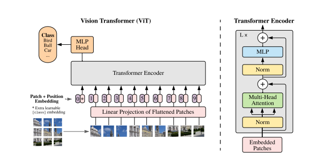
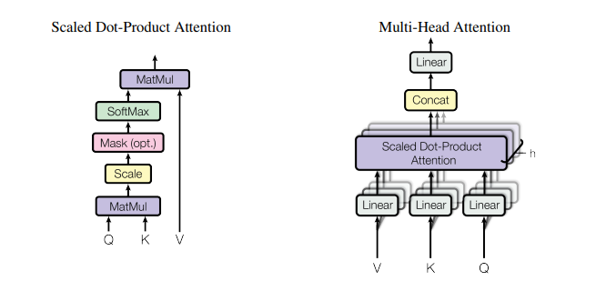
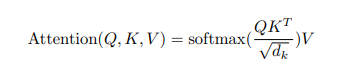

# Classify Alzheimer’s disease by vision transformer
## Main Purpose

This project aims to implement a vision transformer to Classify Alzheimer’s disease and have a minimum accuracy of 0.8 on the test set. I am sorry that I did not achieve this goal and the code of this project may have some problems. In this document, I will describe the structure of the model and the parts that have been implemented.

## Model structue

The main modules of ViT include main 3 parts: "Embedded Patches", "Multi-Head Attention" and "Feed Forward"
 
(Figure 1. Dosovitskiy et al., 2020) 

### Embedded Patches

The first step is split the picture.
The image x ∈ H × W × C, where（H, W） is the resolution of the original image and C is the number of channels. Dividing it into non-overlapping patches of size P × P. 
(In this project H = W = 256, C = 3, P = 16) 
The second step is patch embedding.
Flatten the patches and map to D dimensions, which similar to BERT's word embedding operation. 
The Third step is position embedding.
1D position embeddings are added to the patch embeddings to keep the positional information.(After adding position embedding, the data size is (257 × 768))

### Multi-Head Attention

The most important part of Transformer encoder is Multi-Head Attention.
 
 Scaled Dot-Product Attention calculation formula.
 
(Figure 2. Vaswani et al., 2017) 
In this project, I split data to 12 heads, and each dimension is 64. After that, as shown in the figure above, Scaled Dot-Product Attention is calculated first, and then concat together.

### Feed Forward
The structure of the MLP(Feed Forward) in Figure 1 is Linear+ GELU + Dropout + Linear + Dropout. 
The Transformer is constructed as shown in Figure 1. After that, the data is  to 6 serial Transformer encoders for calculation. 
 
Here the structure of the model is finished. I am sorry to say that I found that the training loss did not converge during the training.

## Requirements 
Python 3.7.15 
torch 1.12.1+cu113 
torchvision 0.13.1+cu113 
einops 0.5.0 
numpy 1.21.6

## Reference
[1]   Dosovitskiy, A., Beyer, L., Kolesnikov, A., Weissenborn, D., Zhai, X., Unterthiner, T., Dehghani, M., Minderer, M., Heigold, G., Gelly, S., Uszkoreit, J., &#38; Houlsby, N. (2020, October 22). An Image is Worth 16x16 Words: Transformers for Image Recognition at Scale. ArXiv.Org. https://arxiv.org/abs/2010.11929 
[2]   Vaswani, A., Shazeer, N., Parmar, N., Uszkoreit, J., Jones, L., Gomez, A. N., Kaiser, L., &#38; Polosukhin, I. (2017, June 12). Attention is all you need. ArXiv.Org. https://arxiv.org/abs/1706.03762

### Codes   
https://github.com/phlippe/uvadlc_notebooks/blob/cde7e46ac091dbe4786ae6400caa1794fe5cf21a/docs/tutorial_notebooks/JAX/tutorial15/Vision_Transformer.ipynb
